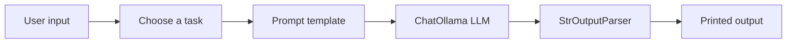

# LCEL Text Generation Pipeline

<p align="center">
  
  
  
</p>

> A small but complete LangChain LCEL practice project that demonstrates prompt templates, chaining, batching, and streaming with a local Ollama model.

---

## Overview

This folder contains a focused text generation demo built with LangChain Core and LCEL. The goal is to show how a simple Python app can route user input into different chain patterns and return useful outputs in a clean terminal experience.

The app supports three tasks:

- Joke generation
- Motivational quote generation
- Text summarization

---

## What this project demonstrates

### 1. Prompt templates

Each task uses a reusable `ChatPromptTemplate` so the prompt logic stays separate from the app flow.

### 2. LCEL chaining

The code combines prompt templates, a chat model, and an output parser using the LCEL pipe style.

### 3. Multiple execution styles

This project shows three useful LangChain behaviors:

- `invoke()` for a single joke response
- `batch()` for multiple motivational quotes
- `stream()` for live summary output

### 4. Local model usage

The app uses `ChatOllama`, so it can run against a local Ollama setup instead of relying on a hosted API.

---

## Folder structure

```bash
1. LCEL Text Generation Pipeline/
├── app.py
├── chains/
│   ├── joke_chain.py
│   ├── Motivational_quote_generator_prompt.py
│   └── Summary_generator_chain.py
└── prompts/
    ├── joke_prompt.py
    ├── Motivational_quote_generator_prompt.py
    └── Summary_generator_prompt.py
```

---

## How it works



### Joke flow

1. The user enters a topic.
2. `joke_prompt` formats the request.
3. `generate_joke()` runs the chain with `invoke()`.
4. The response is printed in the terminal.

### Quotes flow

1. The user enters several topics separated by commas.
2. `motivational_quote_prompt` is applied to each topic.
3. `generate_motivational_quote_with_batch()` runs the chain with `batch()`.
4. A quote is printed for each topic.

### Summary flow

1. The user pastes text to summarize.
2. `summary_prompt` formats the request.
3. `generate_summary_with_streaming()` runs the chain with `stream()`.
4. The summary appears chunk by chunk.

---

## Files

### [app.py](app.py)

Main terminal app that asks the user what they want to generate and routes the request to the correct chain.

### [chains/joke_chain.py](chains/joke_chain.py)

Builds the joke chain and returns a single joke response.

### [chains/Motivational_quote_generator_prompt.py](chains/Motivational_quote_generator_prompt.py)

Builds the motivational quote chain and handles batch generation for multiple topics.

### [chains/Summary_generator_chain.py](chains/Summary_generator_chain.py)

Builds the summary chain and streams the generated output.

### [prompts/joke_prompt.py](prompts/joke_prompt.py)

Contains the prompt template for joke generation.

### [prompts/Motivational_quote_generator_prompt.py](prompts/Motivational_quote_generator_prompt.py)

Contains the prompt template for motivational quote generation.

### [prompts/Summary_generator_prompt.py](prompts/Summary_generator_prompt.py)

Contains the prompt template for summarization.

---

## Requirements

- Python 3.10 or newer
- LangChain and LangChain Core
- Ollama installed locally
- The `mistral` model, or another compatible chat model

If dependencies are managed through the root project, install them from the root `pyproject.toml`.

---

## Run it

From the repository root, run:

```bash
python "1. LCEL Text Generation Pipeline/app.py"
```

Then choose one of these options:

- `joke`
- `quotes`
- `summary`

---

## Example inputs

### Joke

- Topic: `cats`

### Quotes

- Topics: `focus, discipline, growth`

### Summary

- Paste any paragraph, article, or note you want condensed.

---

## Why this folder exists

This project is a compact practice ground for understanding LangChain basics before moving into more advanced agent workflows, retrieval systems, and LangGraph graphs.

It is meant to be readable, runnable, and easy to extend.

---

## Next improvements

- Add error handling for blank input
- Support more output styles
- Add tests for each chain helper
- Expand this folder into a richer LCEL demo

---

## Key Learnings

- LCEL pipe operator (`|`)
- Runnable components
- Prompt templates
- invoke()
- batch()
- stream()
- Output parsers
