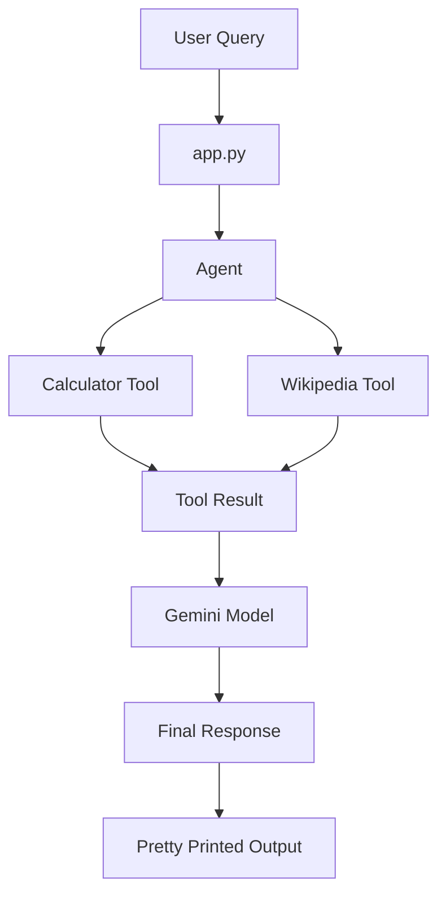
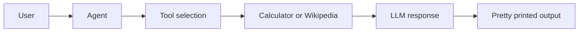

# Custom Tool and Agent Basics

<p align="center">
  
  
  
</p>

> A focused demo of building a tool-using agent with LangChain. This project shows how to create custom tools, connect them to an agent, and return structured responses based on user queries.

---

## Overview

This folder shows the basics of building a tool-using agent with LangChain. The project is intentionally small, but it demonstrates the core pattern behind practical agentic systems:

- accept a user query
- send it to an agent
- let the agent decide when to use tools
- return a formatted response

The current demo asks one combined question:

- What is the capital of France?
- What is 5 multiplied by 7?

That single query exercises both the Wikipedia tool and the calculator tool.

---

## What this project demonstrates

### 1. Custom tool creation

The calculator is implemented as a LangChain tool using `@tool`, which makes it available to the agent in a standard, reusable way.

### 2. Built-in knowledge extension

The Wikipedia tool gives the agent a way to fetch factual information instead of guessing.

### 3. Tool-using agent loop

The agent is created with `create_agent(...)` and given access to both tools. It can decide which tool to use based on the user prompt.

### 4. Structured response inspection

The final response is printed with `rich` so the message objects are easy to inspect during practice and debugging.

---

## Architecture



---

## Folder structure

```bash
2. Custom Tool and Agent Basics/
├── app.py
├── README.md
├── print.py
├── Agent/
│   └── agent.py
├── calculator_tool/
│   └── tool.py
├── wikipedia_tool/
│   └── tool.py
└── llm/
    └── geminiAi.py
```

---

## How it works

### App entrypoint

The top-level script in [app.py](app.py) sends a sample query into the agent and prints the response.

### Agent setup

The agent in [Agent/agent.py](Agent/agent.py) wires together:

- `calculator` for arithmetic
- `wiki_tool` for factual lookup
- `ChatGoogleGenerativeAI` for reasoning and response generation

### Tools

The tools are defined separately so each responsibility stays isolated.

- [calculator_tool/tool.py](calculator_tool/tool.py) handles add, subtract, multiply, and divide
- [wikipedia_tool/tool.py](wikipedia_tool/tool.py) fetches concise Wikipedia results

### Model configuration

The model is loaded in [llm/geminiAi.py](llm/geminiAi.py) using environment variables from `.env`.

### Response formatting

The helper in [print.py](print.py) prints the returned message objects in a readable JSON format.

---

## Example request

The current example query is:

> What is the capital of France and what is 5 multiplied by 7?

This is a good demo because it requires two different capabilities:

- factual lookup for the capital of France
- arithmetic reasoning for multiplication

---

## Key files

### [app.py](app.py)

Main runner for the demo.

### [Agent/agent.py](Agent/agent.py)

Creates the agent, registers tools, and defines the system prompt.

### [calculator_tool/tool.py](calculator_tool/tool.py)

Defines a custom calculator tool with four supported operations:

- add
- subtract
- multiply
- divide

### [wikipedia_tool/tool.py](wikipedia_tool/tool.py)

Creates a Wikipedia query tool that retrieves short English summaries.

### [llm/geminiAi.py](llm/geminiAi.py)

Loads the Gemini chat model used by the agent.

### [print.py](print.py)

Pretty-prints the agent response for inspection.

---

## Why this project matters

This project is useful for understanding the first practical step into agentic AI:

- how tools are exposed to an LLM
- how the agent selects a tool
- how tool outputs flow back into the final answer
- how to keep the code modular and easy to extend

It is a strong foundation for future projects involving search, RAG, SQL, and multi-step agents.

---

## Learning outcomes

By working through this folder, you learn how to:

- build a custom LangChain tool
- integrate a third-party knowledge source
- connect tools to a model-backed agent
- separate prompts, tools, and execution logic into clean modules
- inspect the agent response in a readable format

---

## Setup notes

To run this project successfully, you will need:

- Python installed
- the required LangChain and Google Gemini packages
- a valid Google API key in your environment
- a `.env` file or equivalent environment configuration

Because the project loads the model from environment variables, make sure the Gemini credentials are available before running the script.

---

## Run it

From the repository root, run:

```bash
python "2. Custom Tool and Agent Basics/app.py"
```

---

## Visual learning summary



---

## Key Learnings

- Custom tools with `@tool`
- Tool-augmented agents
- Promptless agent orchestration
- Calculator logic as a tool
- Wikipedia lookup as a tool
- Gemini model integration
- Response inspection with `rich`
