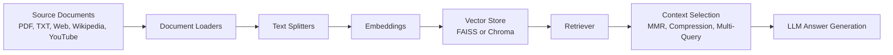
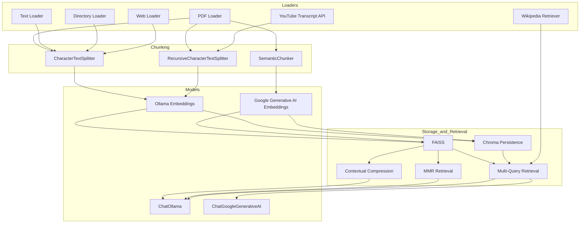

# Retrieval Q&A with Document Loaders

> A notebook-driven Retrieval-Augmented Generation (RAG) learning suite that demonstrates document loading, text splitting, vector storage, and question answering over PDFs, text files, web pages, Wikipedia, and YouTube transcripts.


**Project Categories:** RAG, Document Processing, Vector Search, Semantic Retrieval, Notebook Demos, LLM Workflows

---

## Project Overview

This folder is a hands-on exploration of how a RAG system is built from the ground up.
It shows how different source types are loaded into LangChain `Document` objects, how text is split into chunks, how embeddings are stored in vector databases, and how retrieval methods improve question answering.

The project is useful for:
- Recruiters who want a quick view of practical AI/LLM work
- Hiring managers reviewing applied RAG skills
- Technical interviewers looking for document ingestion and retrieval patterns
- GitHub visitors who want a clear notebook-based reference for LangChain workflows

---

## Key Features

| Feature | Description |
|---|---|
| PDF Loading | Loads a sample PDF with `PyPDFLoader` and preserves metadata such as page numbers and source path. |
| Text Loading | Loads a UTF-8 text file with `TextLoader` and passes its content into downstream processing. |
| Directory Loading | Uses `DirectoryLoader` to batch-load PDF and text files from a folder. |
| Web Loading | Uses `WebBaseLoader` to scrape a live Amazon product page into `Document` objects. |
| Fixed-Size Chunking | Demonstrates `CharacterTextSplitter` with chunk size and overlap control. |
| Semantic Chunking | Uses `SemanticChunker` with Google embeddings to split text by topical similarity. |
| Structure-Aware Chunking | Uses `RecursiveCharacterTextSplitter` to preserve document structure while chunking. |
| Contextual Compression | Uses a compression retriever to reduce retrieved context before answering. |
| Diversity-Aware Retrieval | Demonstrates Maximum Marginal Relevance (MMR) retrieval with FAISS. |
| Multi-Query Retrieval | Expands a user query into multiple variants to improve recall. |
| Wikipedia Retrieval | Uses `WikipediaRetriever` for external knowledge lookup with error handling. |
| Persistent Vector Storage | Persists embeddings with Chroma in local `chroma_db/` and `video_db/` directories. |
| YouTube Transcript RAG | Builds a transcript-based chatbot from a YouTube video using chunking, embeddings, retrieval, and QA. |

---

## Architecture





---

## Folder Map

```text
3. Retrieval Q&A with Document Loaders/
├── Document Loader/
│   ├── directory_loader.ipynb
│   ├── pdf_loader.ipynb
│   ├── text_loader.ipynb
│   ├── web_based_loader.ipynb
│   ├── example.txt
│   └── Example.pdf
├── Text Splitter/
│   ├── length_based.ipynb
│   ├── semantic_based_splittter.ipynb
│   └── text_structure_based_splitter.ipynb
├── Retriever/
│   ├── ContextualCompressionRetriever.ipynb
│   ├── Maximum_marginal_relevance_retriever.ipynb
│   ├── Multiquery Retriever.ipynb
│   └── wikipedia_retriever.ipynb
├── Vector Store/
│   ├── chromea_bd.ipynb
│   └── chroma_db/
│       └── chroma.sqlite3
├── Youtube Chatbot/
│   ├── yt_chatbot.ipynb
│   └── video_db/
│       └── chroma.sqlite3
└── The GTA VI Document (v1.0).pdf
```

---

## What Each Section Demonstrates

### Document Loader
This section shows how to convert different sources into LangChain documents.
It includes single-file loading, batch directory loading, text file loading, and web scraping from an Amazon product page.

### Text Splitter
This section compares multiple chunking strategies.
It includes fixed-size chunking, semantic chunking, and recursive structure-aware splitting.

### Retriever
This section demonstrates how retrieval quality can be improved using contextual compression, MMR, query reformulation, and Wikipedia lookup.

### Vector Store
This section builds a persistent Chroma-backed RAG pipeline over the sunscreen PDF sample and tests retrieval with multiple questions.

### YouTube Chatbot
This section builds an end-to-end transcript-based RAG demo from a YouTube video about RAG and long-context tradeoffs.

---

## Tech Stack

- Python
- LangChain community, classic, experimental, Chroma integration, and text splitters
- LangChain Ollama
- LangChain Google Generative AI
- Chroma vector store
- FAISS vector store
- YouTube Transcript API
- Wikipedia API
- Jupyter notebooks

---

## Sample Data Used

- `Example.pdf`: A sunscreen review PDF used across loading, splitting, and vector-store demos.
- `example.txt`: A plain text sample used for text loading.
- Amazon product page: Used to demonstrate web-based loading.
- YouTube video transcript: Used to demonstrate transcript ingestion and RAG chat.
- `The GTA VI Document (v1.0).pdf`: Present in the folder as a reference file.

---

## Learning Outcomes

By working through these notebooks, you can learn how to:
- Load documents from files, URLs, APIs, and transcripts
- Convert raw content into reusable `Document` objects
- Split long text into retrieval-friendly chunks
- Choose between chunking strategies based on document structure
- Persist embeddings locally for later retrieval
- Improve retrieval with compression, MMR, and query expansion
- Build small end-to-end RAG demos that answer questions from custom content

---

## Limitations

This folder is best understood as a learning and experimentation workspace.
It does not show a production deployment layer, authentication, evaluation metrics, or benchmark comparisons.
The notebooks focus on specific sample sources rather than broad format coverage, so claims about OCR, DOCX, CSV, or enterprise-grade scaling would be misleading here.

---

## Repository Notes

- The notebooks are self-contained demos rather than a single packaged application.
- The vector stores are persisted locally in `chroma_db/` and `video_db/`.
- The project uses a mix of local Ollama models and Google generative AI models depending on the notebook.
- The YouTube chatbot and vector-store notebook are the strongest end-to-end examples in the folder.

---

## Why This Project Matters

This folder captures the core building blocks of practical RAG systems:
source ingestion, chunking, embeddings, retrieval, persistence, and answer generation.
That makes it useful as a portfolio artifact because it shows applied understanding of document QA pipelines, not just isolated LangChain snippets.
