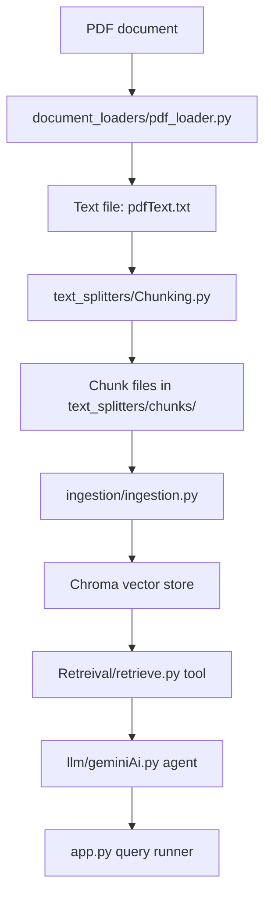

# Retrieval Q&A with Document Loaders


This project is a small Retrieval-Augmented Generation (RAG) practice app built around a local PDF source. It extracts text from a document, splits it into chunks, stores embeddings in a Chroma vector database, and exposes a LangChain tool that a Gemini-powered agent can use to answer questions from the indexed content.

---

## 🚀 Overview

The project demonstrates a complete local document-question-answering pipeline. It exists as a hands-on LangChain practice project for learning how document loaders, text splitters, embeddings, vector stores, tools, and agents fit together in a RAG workflow.

The main problem it solves is simple: turn an unstructured PDF into retrievable context, then let an agent answer questions against that context instead of relying only on model memory.

Intended users include Python developers, LangChain learners, and anyone experimenting with local RAG pipelines or agent tool-calling patterns.

---

## ✨ Features

* PDF text extraction using PyMuPDF.
* Recursive character chunking for document segmentation.
* Ollama-based embeddings with a local embedding model.
* Persistent Chroma vector storage.
* LangChain tool wrapper for similarity search.
* Gemini chat model integration through `create_agent`.
* Console-based response inspection with Rich JSON output.

---

## 🏗 Architecture

The system follows a straightforward ingest-index-retrieve-answer flow:



### Components

* `document_loaders/pdf_loader.py` extracts text from the source PDF into a plain text file.
* `text_splitters/Chunking.py` splits the extracted text into smaller chunks and writes them to disk.
* `embeddings/embedding.py` configures the embedding model and persistent Chroma collection.
* `ingestion/ingestion.py` loads chunk files as LangChain documents and adds them to the vector store.
* `Retreival/retrieve.py` defines the retrieval tool used by the agent.
* `llm/geminiAi.py` creates a Gemini-backed agent with the retrieval tool attached.
* `app.py` runs a sample query and prints the returned message objects.

### Data Flow

1. The PDF is read and converted to text.
2. The text is split into overlapping chunks.
3. Each chunk is wrapped as a LangChain `Document` with source metadata.
4. Chroma stores chunk embeddings in `./chroma_langchain_db`.
5. A retrieval tool performs vector similarity search for user queries.
6. A Gemini agent calls the tool when it needs supporting context.
7. The app prints the full response message payload for inspection.

---

## 📂 Project Structure

```text
3. Retrieval Q&A with Document Loaders/
├── app.py
|
├── README.md
|
├── The GTA VI Document (v1.0).pdf
|
├── print.py
|
├── chroma_langchain_db/
|
├── document_loaders/
│   ├── __init__.py
│   └── pdf_loader.py
|
├── embeddings/
│   ├── __init__.py
│   └── embedding.py
|
├── ingestion/
│   ├── __init__.py
│   └── ingestion.py
|
├── llm/
│   └── geminiAi.py
|
├── Retreival/
│   ├── __init__.py
│   └── retrieve.py
|
└── text_splitters/
    ├── __init__.py
    ├── Chunking.py
    └── chunks/
```

---

## 🛠 Tech Stack

| Category | Technology |
| --- | --- |
| Language | Python 3.12+ |
| Agent Framework | LangChain |
| LLM Provider | Google Gemini |
| Embeddings | OllamaEmbeddings |
| Vector Store | Chroma |
| Text Splitting | RecursiveCharacterTextSplitter |
| PDF Parsing | PyMuPDF / PyMuPDF4LLM |
| Console Output | Rich |
| Environment Loading | python-dotenv |

---

## ⚙ Installation

> This project is configured through `pyproject.toml` and expects the required local services and API keys to be available.

1. Install Python 3.12 or newer.
2. Make sure Ollama is installed and running locally.
3. Make sure you have access to a Google Gemini API key.
4. From the repository root, install dependencies:

```bash
uv sync 
```

5. If you prefer a virtual environment, create and activate one first, then install the project dependencies.

---

## 🔧 Configuration

The codebase uses `dotenv` to load environment variables from a local `.env` file, but no variable names are declared in the repository. Based on the implementation, the following external configuration is required:

| Setting | Purpose | Source |
| --- | --- | --- |
| Gemini API credentials | Authenticates `ChatGoogleGenerativeAI` | Environment / `.env` |
| Ollama runtime | Serves the local embedding model | Local Ollama service |
| Chroma persistence directory | Stores the vector database | `./chroma_langchain_db` |

The embedding model is hard-coded as `qwen3-embedding:0.6b`, and the chat model is hard-coded as `gemini-3.1-flash-lite`.

---

## ▶ Usage

The repository is organized as a sequence of small scripts rather than a single production app.

### 1. Extract text from the PDF

Run the loader in `document_loaders/pdf_loader.py` to produce `pdfText.txt` from `The GTA VI Document (v1.0).pdf`.

### 2. Split the text into chunks

Run `text_splitters/Chunking.py` to generate chunk files under `text_splitters/chunks/`.

### 3. Ingest chunks into Chroma

Run `ingestion/ingestion.py` to load the chunk files as LangChain documents and persist them to Chroma.

### 4. Query the agent

Run `app.py` to execute the sample question:

```bash
uv run app.py
```

The script currently sends a fixed example query:

```text
GTA 6 story is inspired by what?
```

### 5. Inspect the response

The `print.py` helper prints each returned message as formatted JSON so you can inspect the agent output structure.

> Tip: if you want to ask a different question, update the `query` value in `app.py`.

---

## 🔄 Workflow

1. Load the source PDF and extract its text content.
2. Split the extracted text into overlapping chunks for retrieval quality.
3. Convert each chunk into a LangChain `Document` with source metadata.
4. Embed and store the documents in a persistent Chroma collection.
5. Expose retrieval as a LangChain tool using similarity search by query embedding.
6. Attach the tool to a Gemini agent.
7. Invoke the agent from the CLI entrypoint and inspect the returned messages.

---

## 📊 Key Components

| Component | Purpose |
| --- | --- |
| `app.py` | CLI entrypoint that runs a sample retrieval question through the agent. |
| `llm/geminiAi.py` | Creates the Gemini chat model and the LangChain agent with the retrieval tool. |
| `Retreival/retrieve.py` | LangChain tool that performs similarity search against the vector store. |
| `embeddings/embedding.py` | Configures Ollama embeddings and the persistent Chroma store. |
| `ingestion/ingestion.py` | Reads chunk files, wraps them as documents, and stores them in Chroma. |
| `text_splitters/Chunking.py` | Breaks extracted PDF text into chunk files for ingestion. |
| `document_loaders/pdf_loader.py` | Extracts raw text from the PDF source document. |
| `print.py` | Pretty-prints agent messages as JSON for debugging and inspection. |

---

## 📈 Future Improvements

* Replace the hard-coded sample query in `app.py` with interactive user input.
* Add error handling around missing PDF, missing chunk files, and unavailable Ollama or Gemini services.
* Move hard-coded model names into configuration variables.
* Add tests for chunking, retrieval, and ingestion behavior.
* Fix the `Retreival` package spelling for consistency and maintainability.
* Add a repeatable setup script for rebuilding the index from the source PDF.

---

## 🤝 Contributing

Contributions are welcome. A practical workflow is:

1. Fork the repository.
2. Create a feature branch.
3. Make focused changes with clear commit messages.
4. Verify the ingestion and retrieval scripts still run as expected.
5. Open a pull request with a concise summary of the change.

Please keep changes aligned with the existing LangChain practice-project style and avoid introducing unnecessary abstractions.

---
