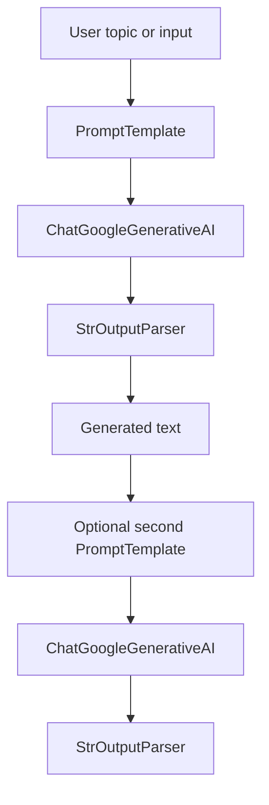

# Structured Output and Output Parsing


This folder contains a small LangChain practice project focused on prompt templates, output parsing, and LCEL composition. The examples use Google Gemini through `langchain-google-genai` to generate text, parse model output with `StrOutputParser`, and chain multiple prompt-model steps together.

---

## 🚀 Overview

The project demonstrates how to build simple, composable language-model pipelines in Python using LangChain. It exists as a hands-on learning space for understanding prompt formatting, model invocation, plain-text parsing, and sequential chain composition.

The main problem it solves is learning how to turn raw model responses into predictable text outputs that can be reused in later steps. It is intended for developers studying LangChain, LCEL, and structured prompt-driven workflows.

---

## ✨ Features

* Prompt template creation with `PromptTemplate`
* Google Gemini model access through `ChatGoogleGenerativeAI`
* Plain-text response extraction with `StrOutputParser`
* LCEL chain composition using the `|` operator
* Demonstrations of multi-step text generation and summarization
* Notebook-based experimentation for iterative learning

---

## 🏗 Architecture

The repository is intentionally lightweight and centers on a linear prompt-to-model-to-parser workflow. The Python script shows simple message objects and string parsing, while the notebook demonstrates chained generation and summarization.



### Main components

* `text.py` prints LangChain message objects and parses a string response.
* `Output Parser/StrOutputParser.ipynb` builds a two-step text pipeline that generates a detailed report and then summarizes it.
* `sturctured_output.ipynb` is present as an additional practice notebook, but it has not been executed in the current workspace snapshot.

### Data flow

1. A topic or text input is formatted by a prompt template.
2. Gemini generates a response.
3. `StrOutputParser` converts the model output into plain text.
4. The parsed output can be passed into another prompt for a second generation step.

---

## 📂 Project Structure

```text
4. Conversational Agent with Short-Term Memory/
├── README.md
├── text.py
├── sturctured_output.ipynb
└── Output Parser/
    └── StrOutputParser.ipynb
```

---

## 🛠 Tech Stack

| Category | Technology |
| --- | --- |
| Language | Python 3.12+ |
| AI Framework | LangChain |
| Output Parsing | LangChain Core `StrOutputParser` |
| Model Provider | Google Gemini |
| Integration Library | `langchain-google-genai` |
| Notebook Environment | Jupyter / IPython |
| Configuration | `python-dotenv` |

---

## ⚙ Installation

The project is designed to run from a Python environment with the dependencies listed in the workspace `pyproject.toml`.

```bash
python -m venv .venv
.venv\Scripts\activate
pip install --upgrade pip
pip install -e .
```

If you prefer plain dependency installation:

```bash
pip install langchain langchain-google-genai python-dotenv ipywidgets rich
```

---

## 🔧 Configuration

The notebooks and script rely on environment-based configuration for API access.

| Variable | Required | Purpose |
| --- | --- | --- |
| `GOOGLE_API_KEY` | Yes | Authenticates requests to Google Gemini through `langchain-google-genai` |

The notebooks call `load_dotenv()`, so a local `.env` file is the expected place to store secrets.

Example `.env`:

```env
GOOGLE_API_KEY=your_google_api_key_here
```

No project-specific config file, database, vector store, or CI workflow is present in this folder snapshot.

---

## ▶ Usage

Run the script or open the notebooks to experiment with prompt formatting and parsing.

```bash
python "4. Conversational Agent with Short-Term Memory/text.py"
```

In the notebook example, the core pattern looks like this:

```python
chain = template1 | model | parser | template2 | model | parser
res = chain.invoke({"topic": "Artificial Intelligence"})
```

The script in `text.py` shows a small message/parsing demo:

```python
from langchain_core.messages import HumanMessage, SystemMessage, AIMessage
from langchain_core.output_parsers import StrOutputParser

parser = StrOutputParser()
print(parser.parse(ai.content))
```

---

## 🔄 Workflow

1. Define a prompt template for the target output.
2. Load environment variables with `dotenv`.
3. Initialize the Gemini chat model.
4. Send the prompt to the model.
5. Parse the response into plain text with `StrOutputParser`.
6. Optionally feed the parsed output into a second prompt to produce a summary.

---

## 📊 Key Components

| Component | Purpose |
| --- | --- |
| `text.py` | Minimal example showing LangChain message objects and string parsing |
| `Output Parser/StrOutputParser.ipynb` | Demonstrates prompt templating, Gemini invocation, and chained parsing |
| `sturctured_output.ipynb` | Additional notebook for structured output practice |
| `PromptTemplate` | Formats reusable prompts with variables |
| `ChatGoogleGenerativeAI` | Connects the project to Gemini models |
| `StrOutputParser` | Converts model responses into plain text |

---

## 📈 Future Improvements

* Add executed notebook outputs and explanatory markdown for each example.
* Expand the demo to include structured JSON or Pydantic output parsing.
* Add tests for prompt formatting and chain composition.
* Include a reusable `.env.example` file.
* Add a lightweight CLI entry point for running the demos without notebooks.

---

## 🤝 Contributing

Contributions are welcome. If you extend the examples, keep the code small, readable, and focused on LangChain learning workflows.

Suggested contribution flow:

1. Fork the repository.
2. Create a feature branch.
3. Add or update a focused example.
4. Verify the notebook or script still runs.
5. Open a pull request with a clear description of the change.

---

## 📜 License

License information not found.
