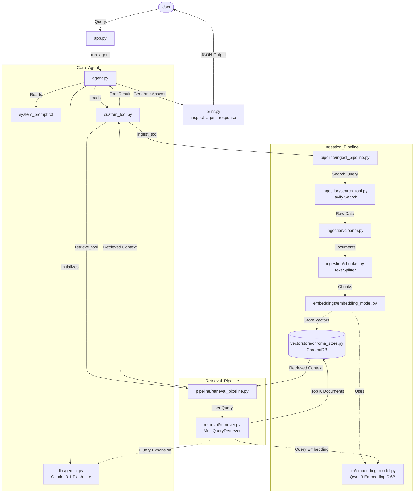
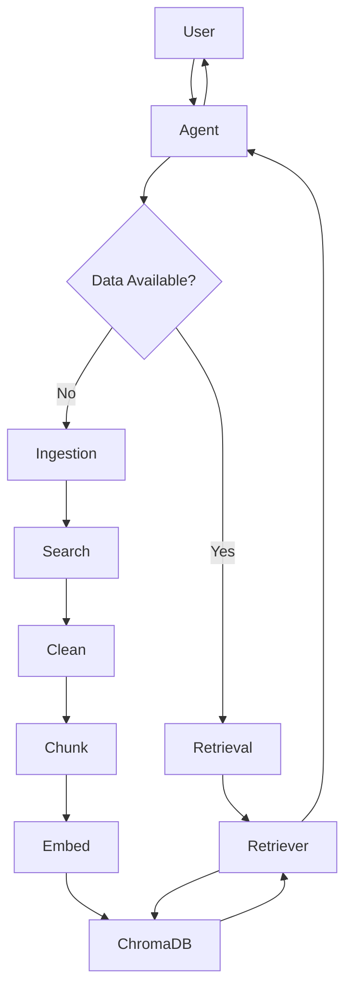
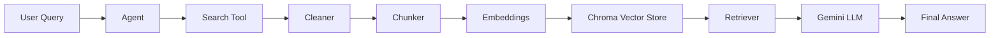

# Web-Enabled RAG Agent with Search API

> **A Python-based retrieval-augmented generation (RAG) agent that combines web search, document ingestion, embeddings, Chroma vector storage, and Gemini-powered generation.**


[Overview](#overview) · [Features](#key-features) · [Tech Stack](#tech-stack) · [Folder Structure](#folder-structure) · [Installation](#installation) · [Usage](#usage) · [Workflow](#api--workflow--architecture) · [Roadmap](#roadmap) · [Contact](#contact)

---

## Elevator Pitch

This project builds a **web-enabled RAG agent** that searches for recent information, cleans and chunks the content, stores embeddings in a persistent vector database, and retrieves the most relevant context before generating an answer.

It is designed for **news-style question answering**, **semantic retrieval**, and **LLM-assisted research workflows**.

---

## Table of Contents

- [Overview](#overview)
- [Key Features](#key-features)
- [Tech Stack](#tech-stack)
- [Folder Structure](#folder-structure)
- [Installation](#installation)
- [Usage](#usage)
- [Screenshots / Demo](#screenshots--demo)
- [API / Workflow / Architecture](#api--workflow--architecture)
- [Contribution](#contribution)
- [Roadmap](#roadmap)
- [License](#license)
- [Contact](#contact)

---

## Overview

**Web-Enabled RAG Agent with Search API** is a modular Python project that connects:

- a **web search tool** for fresh content retrieval,
- an **ingestion pipeline** for cleaning and chunking documents,
- an **embedding layer** for semantic vectorization,
- a **Chroma vector store** for persistent retrieval,
- and a **Gemini LLM** for final response generation.

The project is organized for clarity and reuse, making it easy to follow for recruiters, hiring managers, and developers reviewing the architecture quickly.

> **Use case:** ask a question, search the web for recent context, ingest the most relevant content, and retrieve supporting chunks for LLM-based answers.

---

## Key Features

- **Web-enabled RAG flow** for retrieving up-to-date context before generation.
- **Search API integration** through a Tavily-based search tool.
- **Document cleaning and chunking** to prepare raw search results for retrieval.
- **Embedding-based indexing** for semantic similarity search.
- **Persistent Chroma vector storage** for reuse across sessions.
- **Multi-query retrieval** to broaden recall for user questions.
- **Gemini-powered agent execution** for natural language responses.
- **Modular project layout** with separate ingestion, retrieval, LLM, and vector store layers.

<details>
<summary><strong>What makes this project recruiter-friendly?</strong></summary>

- Clear end-to-end AI workflow
- Practical use of modern NLP and vector database concepts
- Easy-to-scan structure with separated responsibilities
- Relevant keywords for ATS systems: RAG, embeddings, semantic search, vector database, LangChain, Gemini, Chroma, web search

</details>

---

## Tech Stack

| Layer | Tools / Libraries |
| --- | --- |
| Language | Python |
| Orchestration | LangChain-compatible tools and pipelines |
| LLM | Gemini (`ChatGoogleGenerativeAI`) |
| Search | Tavily Search |
| Embeddings | Ollama embeddings (`qwen3-embedding`) |
| Vector Database | Chroma |
| Data Processing | Document cleaning, text chunking |
| Environment | `.env` configuration |

---

## Folder Structure

```text
6. Web-Enabled RAG Agent with Search API
├── embeddings
│   └── embedding_model.py
├── Ingestion
│   ├── chunker.py
│   ├── cleaner.py
│   └── search_tool.py
├── llm
│   ├── embedding_model.py
│   └── gemini.py
├── pipeline
│   ├── ingest_pipeline.py
│   └── retrieval_pipeline.py
├── retrieval
│   └── retriever.py
├── vectorstore
│   ├── web_search_db
│   │   ├── 7e3420c7-cd90-45bc-8a80-f5a9e45d728a
│   │   │   ├── data_level0.bin
│   │   │   ├── header.bin
│   │   │   ├── length.bin
│   │   │   └── link_lists.bin
│   │   └── chroma.sqlite3
│   └── chroma_store.py
├── web_search_db
│   ├── 27e613da-eee6-4a62-8a59-95d4ddf550fb
│   │   ├── data_level0.bin
│   │   ├── header.bin
│   │   ├── length.bin
│   │   └── link_lists.bin
│   └── chroma.sqlite3
├── agent.py
├── app.py
├── custom_tool.py
├── print.py
└── system_prompt.txt
```



## Simpler


<details>
<summary><strong>Directory notes</strong></summary>

- `app.py` is the main entry point.
- `agent.py` initializes the agent and tools.
- `custom_tool.py` packages the ingestion and retrieval tools.
- `pipeline/` contains the core ingestion and retrieval flows.
- `vectorstore/` stores the Chroma persistence layer.

</details>

---

## Installation

> **Note:** The source summary indicates environment-based configuration and external services. Add your project-specific package installation steps here if your repo uses a requirements file or dependency manager.

1. Clone the repository.
2. Create and activate a Python environment.
3. Install the project dependencies.
4. Add your API credentials and model settings to the environment.

```bash
# Example setup
[create and activate your Python environment]
[install the project dependencies]
[configure your environment variables]
```

---

## Usage

The main execution path starts from `app.py`.

```bash
python app.py
```

Typical flow:

1. The app sends a user question to the agent.
2. The agent decides whether to search the web and/or retrieve stored context.
3. Search results are cleaned and chunked.
4. Chunks are embedded and stored in Chroma.
5. Relevant documents are retrieved with semantic search.
6. Gemini produces the final response.

<details>
<summary><strong>Example workflow</strong></summary>

```text
User query -> Search API -> Cleaner -> Chunker -> Embeddings -> Chroma -> Retriever -> Gemini response
```

</details>

---

## Screenshots / Demo

[Add your screenshot here]

[Add your demo video or live demo link here]

Suggested additions:

- A screenshot of the terminal output or agent response
- A small demo GIF showing ingestion and retrieval
- A short clip of a question answering session

---

## API / Workflow / Architecture

### Core workflow

| Step | Module | Purpose |
| --- | --- | --- |
| 1 | `Ingestion/search_tool.py` | Search the web for recent information |
| 2 | `Ingestion/cleaner.py` | Convert raw results into structured documents |
| 3 | `Ingestion/chunker.py` | Split text into retrievable chunks |
| 4 | `embeddings/embedding_model.py` | Generate embeddings for semantic search |
| 5 | `vectorstore/chroma_store.py` | Initialize or reuse the persistent vector store |
| 6 | `retrieval/retriever.py` | Retrieve relevant context with multi-query retrieval |
| 7 | `llm/gemini.py` | Generate the final answer with Gemini |
| 8 | `agent.py` / `app.py` | Orchestrate the full agent run |

### High-level architecture



<details>
<summary><strong>Architecture notes</strong></summary>

- The project separates **ingestion** from **retrieval** to keep the pipeline maintainable.
- Persistent storage supports repeated use without rebuilding the database every time.
- Multi-query retrieval improves the chance of finding useful supporting context.

</details>

---

## Contribution

Contributions are welcome.

- Fork the repository
- Create a feature branch
- Make your changes
- Test the flow locally
- Open a pull request

```bash
git checkout -b feature/your-change
```

### Checklist

- [ ] Keep changes modular and easy to read
- [ ] Update the README when behavior changes
- [ ] Preserve the existing ingestion and retrieval flow
- [ ] Confirm the app still runs from `app.py`

---

## Roadmap

- [ ] Add a concrete setup guide with exact dependency commands
- [ ] Add screenshots or a short demo GIF
- [ ] Document environment variable names explicitly
- [ ] Add example prompts and expected outputs
- [ ] Add automated tests for ingestion and retrieval helpers

---

## License

[Add your license here]

---

## Contact

**Project maintainer:** [Add your name here]

**GitHub:** [Add your GitHub profile here]

**Email:** [Add your email here]

---

> Built to be readable fast, easy to scan, and clear enough for both technical and non-technical reviewers.
