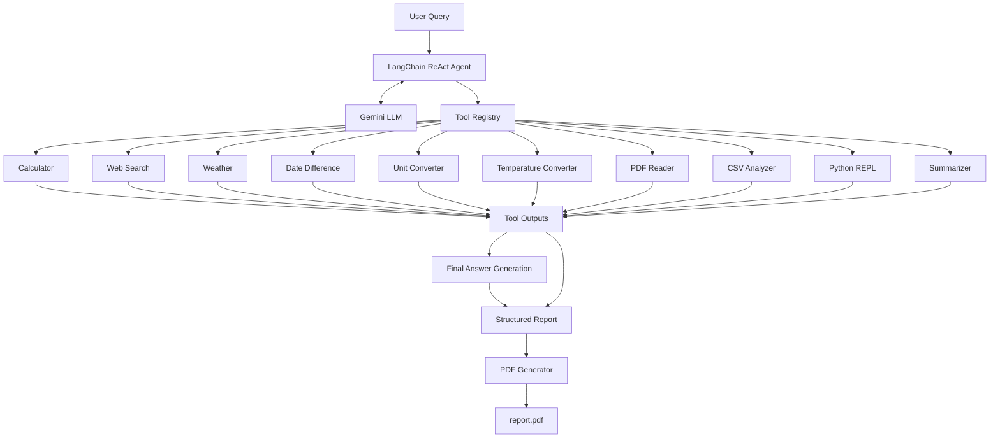

# 🤖 ReAct Agent with Multiple Tools

**A modular, AI-powered Reasoning and Acting (ReAct) agent built with LangChain and Google Gemini, capable of executing complex, multi-step workflows using a diverse suite of custom tools.**

---

## 📖 Project Overview

This project implements a sophisticated AI agent designed to autonomously break down complex user queries, select the appropriate tools, and synthesize a comprehensive final response. By leveraging the LangChain framework and Google's `gemini-3.1-flash-lite` model, the agent acts as an automated problem-solving pipeline. It seamlessly transitions between gathering real-time web data, performing symbolic mathematical calculations, parsing documents, and dynamically executing Python code. Finally, it wraps the intelligent execution cycle by automatically generating a professionally formatted PDF report of its process and findings.

## ✨ Key Features

* **Advanced ReAct Logic:** Uses Reasoning and Acting methodologies to break down complex, multi-layered prompts into solvable steps.
* **Comprehensive Tool Registry:** Equipped with 10+ custom tools including a scientific calculator, web search, weather API, and unit converters.
* **Document Processing:** Natively reads and extracts text from PDFs and CSVs for data-driven answers.
* **Dynamic Code Execution:** Incorporates a Python REPL to generate and run code on the fly.
* **Automated PDF Reporting:** Synthesizes tool inputs, outputs, and final summaries into a styled, production-ready PDF using `reportlab`.
* **Rich Terminal Logging:** Features a custom, Tailwind-inspired terminal logger for visually distinct and easily debuggable execution tracking.

---

## 📂 Folder Structure Overview

```text
9. ReAct Agent with Multiple Tools
├── data/
│   ├── csvs/
│   ├── documents/
│   └── pdfs/
├── llm/
│   └── gemini.py
├── prompts/
│   └── react_prompt.txt
├── tools/
│   ├── calculator.py
│   ├── csv_analyzer.py
│   ├── datetime_tool.py
│   ├── file_writer.py
│   ├── pdf_reader.py
│   ├── python_repl.py
│   ├── summarizer.py
│   ├── unit_converter_tool.py
│   ├── weather_tool.py
│   └── web_Search.py
├── utils/
│   └── logger.py
├── vector_db/
├── agent.py
├── app.ipynb
├── report.pdf
└── tool_merge.py

```

## 🏗️ System Architecture




## 📄 File-by-File Breakdown

| Directory / File | Core Responsibility |
| --- | --- |
| **`agent.py`** | Initializes the LangChain agent. Connects the Gemini LLM to the tool registry and provides core functions (`run_agent`, `create_structured_report`). |
| **`app.ipynb`** | A Jupyter Notebook demonstrating a multi-task user workflow (weather, web search, math, conversions) and displaying the final PDF output. |
| **`tool_merge.py`** | A centralized registry that aggregates all individual utility functions into a single `ALL_TOOLS` array for the agent to access. |
| **`llm/gemini.py`** | Configures the `ChatGoogleGenerativeAI` interface, connecting the system to the `gemini-3.1-flash-lite` model securely via environment variables. |
| **`tools/calculator.py`** | A powerful scientific calculator leveraging `SymPy` and `NumPy` for calculus, algebra, matrix operations, and statistical analysis. |
| **`tools/csv_analyzer.py`** | Uses LangChain's `CSVLoader` to parse and format CSV data into readable text for the agent. |
| **`tools/datetime_tool.py`** | Calculates absolute and signed time intervals between dates. |
| **`tools/file_writer.py`** | Uses `reportlab` to generate beautifully formatted, structured PDF reports detailing the user's query, tools used, and final answers. |
| **`tools/pdf_reader.py`** | Extracts and concatenates text from PDF documents using `pymupdf`. |
| **`tools/python_repl.py`** | A secure `PythonREPL` wrapper allowing the LLM to programmatically execute arbitrary Python code. |
| **`tools/summarizer.py`** | A dedicated Gemini-powered summarization tool for distilling large text chunks. |
| **`tools/unit_converter_tool.py`** | Provides precise conversions across length, weight, data, time, and temperature. |
| **`tools/weather_tool.py`** | Integrates with the OpenWeatherMap API to fetch real-time global weather data. |
| **`tools/web_Search.py`** | Enables the agent to query the internet using the `TavilySearch` engine. |
| **`utils/logger.py`** | A production-grade custom logger offering true-color ANSI output, fixed-width columns, severity badges, and automated text wrapping. |

---

## 🛠️ Tech Stack

* **Core Framework:** LangChain, Python 3
* **Language Model:** Google Gemini API (`gemini-3.1-flash-lite`)
* **External APIs:** Tavily (Web Search), OpenWeatherMap (Weather)
* **Mathematics & Data:** `NumPy`, `SymPy`
* **Document Processing:** `PyMuPDF` (PDF reading), `ReportLab` (PDF writing)
* **Utilities:** `python-dotenv` (secrets management), Custom ANSI Logging

---

## ⚙️ How the System Works

1. **Ingestion:** The user submits a complex prompt containing multiple distinct tasks (e.g., "Find the weather, summarize news, solve x² + 5x + 6 = 0, and convert units").
2. **Reasoning:** The LangChain ReAct agent analyzes the prompt using the `react_prompt.txt` system instructions to determine a logical order of operations.
3. **Acting (Tool Execution):** The agent dynamically selects tools from `tool_merge.py`. It loops through actions—searching the web, delegating math to `SymPy`, or writing Python code—until all tasks are resolved.
4. **Synthesis:** The agent combines the outputs of all tools into a cohesive text response.
5. **Reporting:** The `create_structured_report` pipeline takes the final parsed output and generates a stylized, highly readable `report.pdf` using ReportLab.

---

## 🚀 Setup & Run Instructions

**1. Clone the repository and navigate to the project directory:**

```bash
cd "9. ReAct Agent with Multiple Tools"

```

**2. Install dependencies:**

```bash
uv add langchain langchain-google-genai langchain-community langchain-experimental langchain-tavily sympy numpy pymupdf reportlab python-dotenv

```

**3. Configure Environment Variables:**
Create a `.env` file in the root directory and add your API keys:

```env
GOOGLE_API_KEY=your_gemini_api_key
TAVILY_API_KEY=your_tavily_api_key
OPENWEATHERMAP_API_KEY=your_openweathermap_api_key

```

#### 4. Execute the application:
Run the provided Jupyter Notebook (`app.ipynb`) 

---

## 🎯 Use Cases

* **Academic & Research Assistant:** Simultaneously parse uploaded research PDFs, search the web for the latest related news, and perform complex statistical or calculus operations.
* **Automated Briefing Generator:** Query the weather, check calendar differences, summarize daily industry news, and output everything into a clean morning briefing PDF.
* **Data Processing Pipeline:** Ingest raw CSV files, execute Python REPL scripts to clean the data, and summarize the findings.

---

## 🔮 Future Improvements

* **Persistent Memory:** Integrate a Vector Database (as hinted by the `vector_db` folder) for long-term conversational memory across sessions.
* **Database Tooling:** Add SQL connectors to allow the agent to query live relational databases.
* **Extended Export Options:** Add capabilities to write directly to Word documents (.docx) or send automated emails.

---

## 🤝 Conclusion

This repository demonstrates advanced prompt engineering and agentic design principles. By decoupling capabilities into highly specific tools and letting an LLM orchestrate them, the project bridges the gap between static conversational AI and functional, automated software engineering. It is an excellent template for building autonomous digital workers.