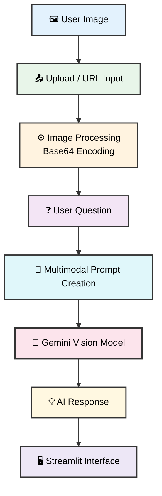

# 🖼️ Multimodal Question Answering Agent

A lightweight multimodal AI application that enables users to ask natural language questions about images and receive intelligent responses powered by Google's Gemini model.

---

## 📌 Project Overview

This project demonstrates how Large Multimodal Models (LMMs) can combine visual understanding with natural language reasoning.

Users can provide an image either through:

* Local file upload
* Public image URL

and ask questions such as:

* What is shown in this image?
* Describe the scene.
* Identify the object.
* What text appears in the image?
* Explain what is happening.

The application converts image data into a model-compatible format, combines it with a user query, and sends both inputs to a Gemini-powered multimodal AI model for analysis.

---

## ✨ Key Features

* Image Question Answering
* Supports Local Image Uploads
* Supports Image URLs
* Automatic Image Processing
* Base64 Image Encoding
* Gemini Vision Integration
* Streamlit Web Interface
* Modular Project Architecture
* Simple Deployment Workflow
* Extensible for Future Vision Applications

---

## 📂 Repository Structure

```text
K. Multimodal Question Answering Agent/
│
├── assets/
│   └── Apple.jpg
│
├── agent.py
├── app.py
├── image_utils.py
├── ui.py
│
└── .env
```

---

## 🧩 File-by-File Breakdown

| File               | Purpose                                                                                                    |
| ------------------ | ---------------------------------------------------------------------------------------------------------- |
| `agent.py`         | Initializes the Gemini model and loads environment variables.                                              |
| `app.py`           | Core application logic that combines image input and text prompts before sending requests to the AI model. |
| `image_utils.py`   | Handles image loading from local paths and URLs and converts images into Base64 format.                    |
| `ui.py`            | Streamlit frontend allowing users to upload images, provide URLs, ask questions, and view responses.       |
| `assets/Apple.jpg` | Sample image used for testing and demonstrations.                                                          |

---

## ⚙️ Tech Stack

### AI & LLM

* Google Gemini Flash Lite
* LangChain

### Backend

* Python

### Frontend

* Streamlit

### Image Processing

* Pillow (PIL)
* Base64 Encoding

### Networking

* Requests
* HTTPX

### Environment Management

* Python Dotenv

---

## 🔄 How the System Works



### Workflow

1. User uploads an image or provides an image URL.
2. The image is loaded and converted into Base64 format.
3. A text question is collected from the user.
4. Both image and text are packaged into a multimodal prompt.
5. Gemini processes the combined inputs.
6. The generated response is returned to the UI.
7. The answer is displayed to the user.

---

## Run Application

```bash
streamlit run ui.py
```

---

## 🎯 Use Cases

### Visual Question Answering
Ask questions about images in natural language.

### Educational Tools
Analyze diagrams, charts, and educational content.

### Accessibility Applications
Generate descriptions for uploaded images.

### Product Analysis
Inspect product images and obtain summaries.

### Content Understanding
Understand visual content without manual inspection.

### AI Learning Projects
Great starter project for learning:

* Multimodal AI
* LangChain
* Gemini APIs
* Streamlit Applications
* Vision-Language Models

---

## 🏗️ Engineering Highlights

* Clear separation of UI and business logic
* Reusable image utility layer
* Modular architecture
* Environment-based configuration
* Scalable project structure
* Easy integration with other LangChain workflows
* Supports both local and remote image sources

---

## 📚 Learning Outcomes

This project demonstrates practical implementation of:

* Multimodal AI Systems
* Vision-Language Models
* Prompt Engineering
* LangChain Integrations
* Image Data Handling
* Streamlit Application Development
* AI-Powered User Interfaces

---

## ✅ Conclusion

The Multimodal Question Answering Agent showcases how modern vision-enabled language models can understand images and answer natural language questions through a clean and interactive web interface. Its modular design, practical architecture, and real-world applicability make it an excellent project for developers exploring multimodal AI, LangChain workflows, and Gemini-powered applications.

Source repository structure and file responsibilities derived from the provided project files and folder layout.
