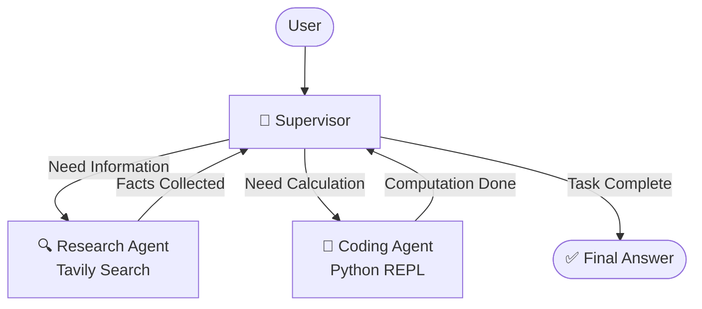
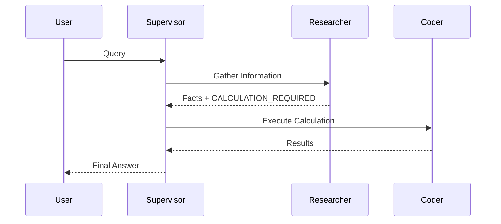

# 🤖 Supervisor Multi-Agent System with LangGraph

<p align="center">


</p>

<p align="center">
A LangGraph-powered Supervisor Agent that intelligently routes tasks between a Research Agent and a Coding Agent to solve complex multi-step problems.
</p>

---

# 🎯 Overview

This project demonstrates a real-world **multi-agent architecture** using LangGraph.

Instead of relying on a single LLM to perform everything, a **Supervisor Agent** decides which specialized agent should handle the next step.

The system contains:

| Agent         | Responsibility                 |
| ------------- | ------------------------------ |
| 🎯 Supervisor | Routing and orchestration      |
| 🔍 Researcher | Fact gathering using Tavily    |
| 🐍 Coder      | Calculations using Python REPL |

The Supervisor continuously evaluates progress and decides:

* Research needed → Researcher
* Math required → Coder
* Task complete → Finish

---

# 🏗 Architecture



---

# 🔄 Execution Flow



---

# ✨ Key Features

## 🎯 Intelligent Routing

The Supervisor determines:

* When research is required
* When calculations are required
* When the workflow is complete

---

## 🔍 Web Research

Uses Tavily Search for:

* Current events
* Statistics
* Population data
* Economic information
* Scientific facts

---

## 🐍 Python Execution

The Coding Agent can:

* Perform calculations
* Compute growth rates
* Analyze numerical data
* Generate projections
* Execute formulas

---

## 🔄 Agent Collaboration

Agents communicate through the graph state.

Example:

```text
User Question
      ↓
Supervisor
      ↓
Researcher
      ↓
CALCULATION_REQUIRED
      ↓
Supervisor
      ↓
Coder
      ↓
Result
      ↓
Supervisor
      ↓
Final Answer
```

---

# 📂 Project Structure

```text
supervisor-agent/

│
├── supervisor_agent.ipynb
│
├── Supervisor Agent
│   ├── Routing Logic
│   ├── Structured Output
│   └── LangGraph Workflow
│
├── Research Agent
│   └── Tavily Search
│
├── Coding Agent
│   └── Python REPL Tool
│
└── Stream Execution
```

---

# 🛠 Tech Stack

| Technology            | Purpose                   |
| --------------------- | ------------------------- |
| LangGraph             | Multi-agent orchestration |
| LangChain             | Agent creation            |
| Gemini 3.1 Flash Lite | LLM                       |
| Tavily Search         | Real-time web search      |
| Python REPL           | Mathematical computation  |
| Rich                  | Terminal visualization    |

---


---

# 🔑 Environment Variables

Create a `.env` file

```env
GOOGLE_API_KEY=your_google_api_key

TAVILY_API_KEY=your_tavily_api_key
```

---

# 🧠 Supervisor Logic

The Supervisor receives the full conversation history and decides the next worker.

Rules:

```text
1. Need facts?
   → Researcher

2. Need calculations?
   → Coder

3. Researcher returns:
   CALCULATION_REQUIRED
   → Coder

4. Everything complete?
   → FINISH
```

---

# 🔍 Research Agent

Research Agent Responsibilities:

✅ Gather information

✅ Search the web

✅ Return factual data

❌ No calculations

❌ No projections

❌ No formulas

Prompt:

```text
You are a researcher.

Your ONLY responsibility is gathering facts.

You may use Tavily.

Never:
- perform calculations
- estimate values
- write Python code

End your response with:

CALCULATION_REQUIRED
```

---

# 🐍 Coding Agent

The Coding Agent is equipped with:

```python
PythonREPL()
```

Capabilities:

* Mathematical analysis
* Compound growth
* Statistical calculations
* Formula execution
* Data transformations

Example:

```python
population = 41000000
growth_rate = 0.008
years = 15

future_population = population * ((1 + growth_rate) ** years)

print(future_population)
```

---

# 📊 State Definition

```python
class State(MessagesState):
    next: str
```

State contains:

* Conversation history
* Routing decision

---

# ⚙ Router Schema

```python
class Router(TypedDict):
    next: Literal[
        "researcher",
        "coder",
        "FINISH"
    ]
```

Structured outputs ensure predictable routing.

---

# 🚀 Example Query

```text
Find the latest population of Canada from a reliable source,
then calculate its projected population after 15 years
assuming 0.8% annual compound growth.
Show the formula, Python calculation,
and final answer.
```

---

# 🔄 Sample Execution

```text
User
 ↓

Supervisor
 ↓

Researcher
 ↓

Population Data Found
CALCULATION_REQUIRED

 ↓

Supervisor
 ↓

Coder
 ↓

Python Calculation
 ↓

Supervisor
 ↓

Final Answer
```

---

# 📈 Why Multi-Agent?

Single-agent systems often:

❌ Mix research and calculations

❌ Hallucinate data

❌ Skip tool usage

❌ Produce inconsistent results

Multi-agent systems provide:

✅ Separation of responsibilities

✅ Better reasoning

✅ Easier debugging

✅ Scalable architecture

✅ Production-ready workflows

---

# 🎨 Terminal Visualization

Rich Panels are used to stream execution.

```python
Panel(
    content,
    title="Agent Output",
    border_style="cyan",
)
```

This allows observing:

* Routing decisions
* Tool usage
* Agent responses
* Final outputs

in real time.

---

---

# 📚 Concepts Demonstrated

* LangGraph StateGraph
* Command-based Routing
* Multi-Agent Architecture
* Tool Calling
* Structured Outputs
* Agent Specialization
* Supervisor Pattern
* Python REPL Tooling
* Tavily Search Integration

---

# 🏆 Learning Outcomes

After completing this project you will understand:

* How Supervisors control agent workflows
* How to build specialized agents
* How to create routing logic
* How LangGraph state transitions work
* How tool-using agents collaborate
* How production multi-agent systems are designed

---

# ⭐ If You Found This Useful

Consider giving the repository a star and using it as a foundation for more advanced multi-agent architectures.

```text
Supervisor
     ↓
Researcher
     ↓
Coder
     ↓
Production AI Systems
```
